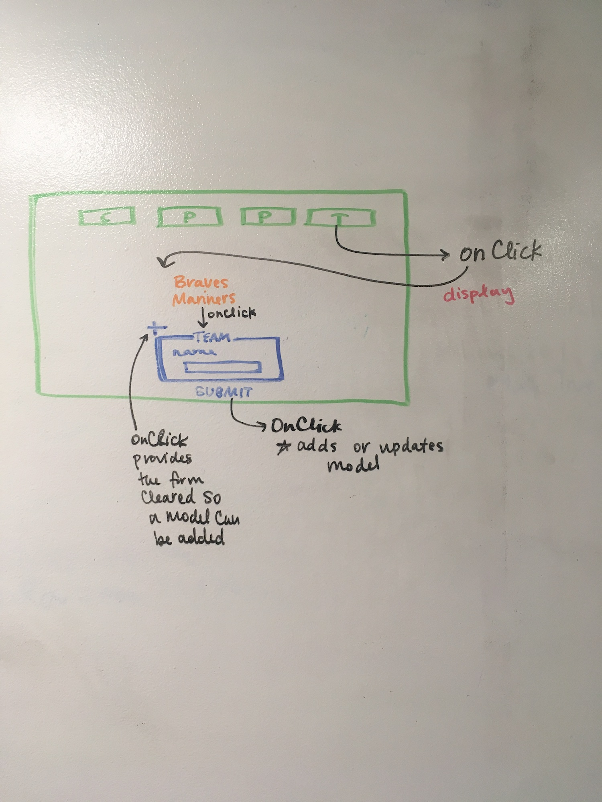
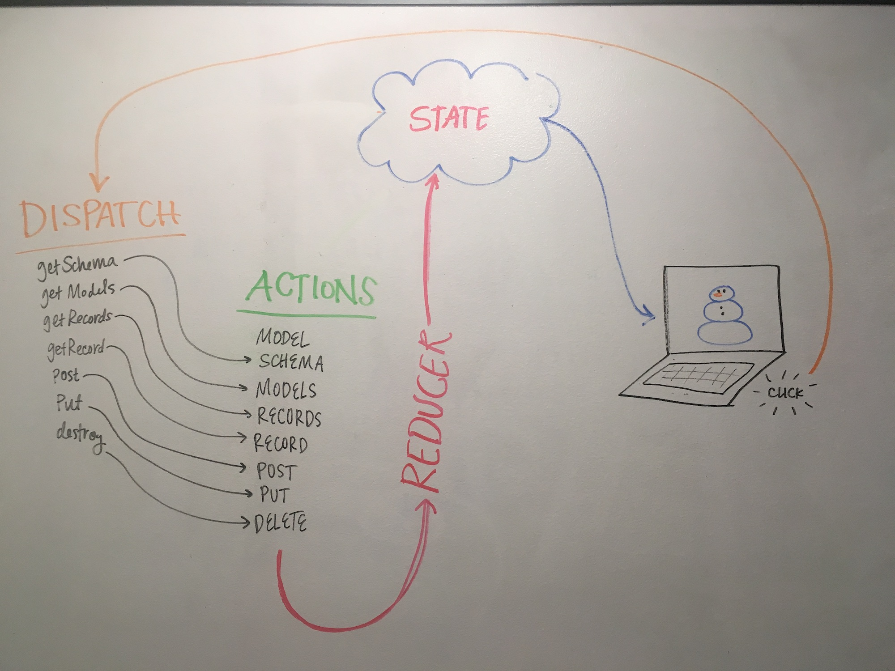

 LAB
=================================================

## Project Name
CMS

### Author: Caity Heath

### Links and Resources
* [repo](https://github.com/CaityHeath/35-project-cms)
* [travis](http://xyz.com)
* [back-end](https://javascript-401-api.herokuapp.com)
* [front-end](http://xyz.com)

### What is it?
CMS stands for Content Management System. Many websites have the need for a CMS or  a way of managing of the content that gets redered to users. A CMS provides an interface for admintrators of web-pages to do just that. This project uses Redux as a framework for a CMS, below is a list of capabilites specific to this project:

* Give the user a list of all data models
* When selecting a model, a list of all records
* When selecting a record, a way to edit or delete the record
* Add a new record to the model

---
### API Endpoints

* The api server supports the following routes:
  * **GET** `/api/v1/models` - A list of all data models
  * **GET** `/api/v1/model` - A list of all records in a given **model**
  * **GET** `/api/v1/model/schema` - The JSON Schema for a given **model**
  * **GET** `/api/v1/model/id` - A single record, from a **model**, with the **id**
  * **DELETE** `/api/v1/model/id` - Delete a single record, from a **model**, with the **id**
  * **PUT** `/api/v1/model/id` - Replace single record, from a **model**, with the **id**
  * **PATCH** `/api/v1/model/id` - Tactically update a single record, from a **model**, with the **id**

---

### Setup
#### `.env` requirements
* `REACT_APP_API` Link to the back end goes here.

#### Running the app
* `npm start`
* Opens a link in your browser giving users access to the CMS.

#### Tests
* How do you run tests?
* What assertions were made?
* What assertions need to be / should be made?

#### UML
Wire-Frame

Redux
